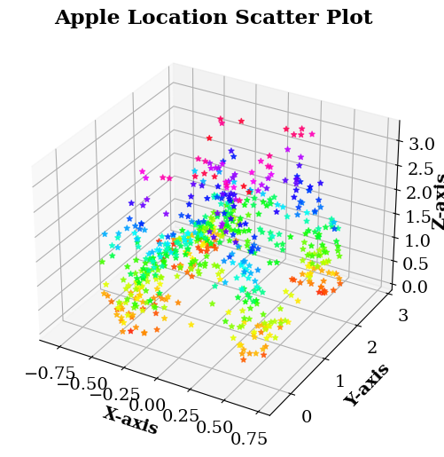
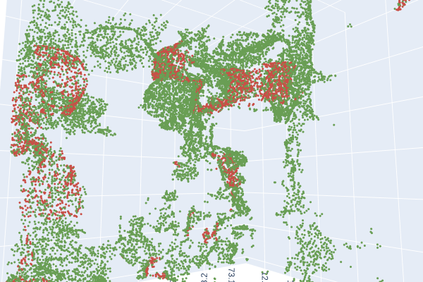

### 3D Segmentation Pipeline on Agricultural Point Cloud Datasets

In this repository we present experimentation for the IE 694's AI in agriculture portfolio.
This codebase contains a point cloud segmentation pipeline for _Fuji Apple_ 3D datasets as shown in Figure 1.
Further, we experiment with different model iterations to further quantitatively evaluate the
segmentation performance of different data processing alternatives chosen for model training.

<p align="center">
  
</p>
<p align="center">
<b>Figure 1:</b> The point cloud segmentation pipeline for processing large scale agriculture datasets.
</p>

## Table of Contents

* [Theoretical Survey and Ideation Work](#theoretical-survey-and-ideation-work)
* [Dataset Description of `Fuji Apple` Point Cloud Datasets](#dataset-description-of-fuji-apple-point-cloud-datasets)
* [Preprocessed `PCL` datasets Descriptions and Download Links](#preprocessed-pcl-datasets-descriptions-and-download-links)
* [Model Training`PCL` datasets Descriptions and Download Links](#model-pcl-datasets-descriptions-and-download-links)
* [`PCL` Upsampling Insights](#pcl-upsampling-insights)
* [Model Training and Experiment Observations](#model-training-and-experiment-bbservations)
* [Experimentation Summarization](#experimentation-summarization)
* [Citing the Experiment Findings and Accompanying Theoretical Document](#citing-the-experiment-findings-and-accompanying-theoretical-document)

#### Theoretical Survey and Ideation Work

This practical experimentation work is accompanied by the titled theoretical work

which explores the blue-sky idea to analyze 3D large scale agriculture with deep learning models.
Please, refer to this work to learn more about background and current research landscape for scope of applying this idea in realistic yield monitoring use-cases.

#### Dataset Description of `Fuji Apple` Point Cloud Datasets

Below we share the original dataset download link provided by the GRAP group from University of Llieda, Spain.
These datasets are acquired by applying SfM on the photographic images of the Fuji apple orchards, refer Figure 2.

<p align="center">
  
</p>
<p align="center">
<b>Figure 2:</b> The isometric view of the Fuji-SfM dataset acquisition process where blue cuboids represent
the bounding box annotations.
</p>

* [`Fuji-SfM dataset`](https://www.grap.udl.cat/en/publications/fuji-sfm-dataset/): 3D point cloud
of scanned scene with annotation of apple locations for 11 Fuji apple trees where the 3D model
is generated using SfM _(Structure from Motion)_ technique.
* [`PFuji-Size dataset`](https://www.grap.udl.cat/en/publications/apple_size_estimation_SfM/): It consists of 3D point
cloud of 615 Fuji apples scanned in-field conditions for three Fuji apple trees using SfM and
MVS _(Multi-View-Stereo)_ techniques.

#### Preprocessed `PCL` datasets Descriptions and Download Links

The the original datasets contains huge number of background point clouds which possibly introduces lot complexities
for the point cloud segmentation models. Therefore, to simplify the model training process based on apple locations of
the `Fuji-SfM` and `PFuji-Size` datasets the additional background point clouds were removed, refer Figure 3.

<p align="center">
  
  
</p>
<p align="center">
<b>Figure 2:</b> The apple location scatter plots for a.) Fuji-SfM <em>(Left)</em> and a.) PFuji-Size <em>(Right)</em> datasets respectively.
</p>

* [`Fuji-SfM data`](https://drive.google.com/file/d/1LHL5gp7agQyTJgodyVzjFw7qUilYZMcM/view?usp=share_link): 
Cropped dataset based on the apple locations with apple PCL KKN based upsampling up to three times the original PCL count.

* [`PFuji-Size-2018-Orchard data`](https://drive.google.com/file/d/19LEgF3_Q5MyxDm9_Ci4kg1VInfCS-oD7/view?usp=sharing): 
Cropped dataset with combined east and west 2018 orchard PCL data with no upsampling, but individual apple patches needs
to be upsampled by 2X factor during the patch generation phase.

* [`PFuji-Size-2020-Orchard data`](https://drive.google.com/file/d/10rwpTwny6eRYvgZzP5zJ6xBornBTCMQD/view?usp=share_link): 
Cropped dataset with combined east and west 2020 orchard PCL data with no upsampling, but individual apple patches needs
to be upsampled by 2X factor during the patch generation phase.

#### Model Training`PCL` datasets Descriptions and Download Links

Considering the complexity of this segmentation task where only the apple class is annotated but other classes like
leaves, branches, and trunks etc. are annotated and combined as a single high fidelity background class.
We further upsampled the apple class point clouds to further simplify the model training task.
Also, we added additional normal estimate features to improve learning performance and created below three dataset versions for experimentation.

* [`Fuji-SfM Model Training Data`](https://drive.google.com/file/d/14ehzotC2FNMxYaozTo7QrsoNPUTxOGrf/view?usp=share_link): 
This dataset only contains the upsampled dataset patches generated from splitting the _Fuji-SfM_ dataset only.

* [`Fuji Complete Training Data`](https://drive.google.com/file/d/1PKrFuXuyglxtLJUDcZNYrIj8fZnhKD2_/view?usp=share_link): 
This dataset only contains the upsampled dataset patches generated from splitting the _Fuji-SfM_ and _Puji-Size_ datasets.

* [`Fuji Normals Complete Training Data`](https://drive.google.com/file/d/1FmG9jR9JKfChSsvo_DmUTY1051dKS8EY/view?usp=share_link): 
This dataset only contains the upsampled dataset patches generated from splitting the _Fuji-SfM_ and _Puji-Size_ datasets
with added additional three normal features for each point cloud data point.

#### `PCL` Upsampling Insights

The  point cloud datasets under analysis are highly undersampled and contain only sparse representations of apple point clouds.
Hence, upsampling the apple point clouds as pre-processing can help the model learn better representations for apple class objects.
Since, the complete point cloud size is very large for _PFuji-SfM_ dataset, we apply the upsampling operation on its patches only.
Whereas for the relatively smaller _Fuji-SfM_ we upsample the apple point cloud when the complete dataset is still together as a monolith.
In our upsampling technique we randomly pick an apple point cloud class point and find its nearest neighbor, after that take an average of
_{X, Y, Z, R, G, B, F1, ... , FK}_ values of the selected random point and nearest neighbor.
And, add this new point to the list of newly generated point clouds, and when this new list size reaches 80 \% existing point cloud size,
then the complete point cloud is updated with the addition of newly generated point clouds.
In below Table 1 and 2, we highlight the difference between original PCL patches, 2X apple point cloud upsampled patches, and
3X apple point cloud upsampled patches.
The point cloud plotter downsampled the points to a maximum of 40K points, therefore the apple point cloud density appears to be almost
similar for all subplots. But, with close observation we can observe that the density of the background class representations is decreasing
as the upsampling factor is increasing.

| **Original Data Patch** | **2X Upsampled Patch** | **3X Upsampled Patch** |
| --- | --- | --- |
|  |  |  |
|  |  |  |
<p align="center">
<b>Table 1:</b> The point cloud upsampling comparison table for <em>Fuji-SfM</em> dataset's point cloud data patches.
</p>

| **Original Segmented Patch** | **2X Upsampled Patch** | **3X Upsampled Patch** |
| --- | --- | --- |
|  |  |  |
|  |  |  |
<p align="center">
<b>Table 2:</b> The point cloud upsampling comparison table for <em>Fuji-SfM</em> dataset's segmented point cloud data patches.
</p>

#### Model Training and Experiment Observations

For our experimentation we train four models to carry model training for four different dataset versions, refer Table 3.
The below table provides the experimentation details for the trained RandLA-Net segmentation models by using Open3D-ML’s implementation.
This implementation provided by Open3D for RandLA-Net is currently the best implementation for this architecture, and gives the best segmentation results on standard benchmarks, like S3DIS, SematicKITTI etc.

| **Model Description and Checkpoint Link** | **Dataset Description _(Features)_** | **Epochs Trained** | **Approximate Epoch Time** | **Learning Rate** |  **Overfitting Detected** |
| --- | --- | --- | --- | --- | --- |
|  | Fuji-SfM _([X,Y,Z])_ | 40+18 | 20 mins / per epoch | 0.0005+0.00025 | Yes |
|  | PFuji-Size + Fuji-SfM _([X,Y,Z,R,G,B])_ | 20 | 55 mins / per epoch | 0.001 | Yes |
|  | PFuji-Size + Fuji-SfM + Normal Features _([X,Y,Z,R,G,B,NX,NY,NZ])_ | 25 | 1 hour / per epoch | 0.001 | Yes |
|  | PFuji-Size + Normal Features - RGB Features _([X,Y,Z,NX,NY,NZ])_ | 15 | 45 mins / per epoch | 0.001 | Yes |

<p align="center">
<b>Table 3:</b> The RandLA-Net model training and experimentation summary for the Fuji apple datasets.
</p>

For all the above experiments trained with different hyperparameters, different epochs, and different datasets none the segmentation model converges.
Since, none of the models have converged in our experimentation settings and data preprocessing methodology, deriving evaluation metrics like, accuracy and mean IoU would not provide any further insights.
In every experiment the model overfits on the point cloud data, where the training performance keeps on increasing, and validation performance is saturated because the model assigns all point cloud data points to a single class.
We attribute this behavior to the model’s inability to process the complex geometries associated with the background class and differentiate it from the apple point cloud representations.

#### Experimentation Summarization

In our experiments we trained four different models as described in the above experimentation methodology section.
All the trained models failed to converge with different dataset iterations and different hyperparameters, like
changed learning rate, batch size etc.
This majorly can be attributed to the complexity of segmentation tasks where countless complex objects like, grass,
branches, trunks, and soil textures are grouped into background class. 
It becomes very hard to differentiate between different objects and classify the apple class point cloud data points.
Therefore, a point cloud dataset with more extensive segmentation annotations can help in building a segmentation model
that correctly segments out Fuji apples directly.

Further, technically the _Fuji-SfM_ dataset provides only bounding box cubical annotations which were translated to
segment apple point clouds for ground truth preparation.
These cubical bounding boxes systematically might have introduced leaf point clouds in these ground truth annotations.
Second, this dataset is rather sparse and does not provide an extensive point cloud for effective model training, 
and might require extensive data augmentation for building robust segmentation models.

And, for the _PFuji-Size_ dataset the documentation of the dataset is rather a bit ambiguous, and hard to follow up with
_*.LAZ_ format point cloud files.
In this dataset, the orchard point clouds and apple annotation files are provided separately for analysis but nowhere it
is explicitly mentioned whether the orchard point cloud files contain the apple annotations within it or not.
We assumed, that these annotations are not present in the shared orchard point clouds, and evidently the models have not
converged or learnt any valuable representations.
So, it might be possible that apple annotations are present in the _*.LAZ_ point cloud files of the orchard dataset.

**In Progress Work Note:** Currently, the _PFuji-Size_ dataset debugging, and more extensive README.md documentation
is in progress.
Additionally, we are also testing data augmentation techniques for the _Fuji-SfM_ dataset to measure any performance gains.
If some data preprocessing flaw is detected we will update the code repository accordingly, and share
the updated notebooks and model checkpoints.

#### Citing the Experiment Findings and Accompanying Theoretical Document

If you find the experimentation work interesting and useful for your work, please consider citing it with:

```
@misc{fuji-point-cloud-analysis,
  author = {Rana, Ashish},
  title = {Exploring Scope of Applying Deep Learning Techniques on 3D Agriculture Data},
  year = {2023},
  publisher = {GitHub},
  journal = {GitHub repository},
  howpublished = {\url{https://github.com/arana-initiatives/agro-point-cloud-seg-pipeline}},
}
```
